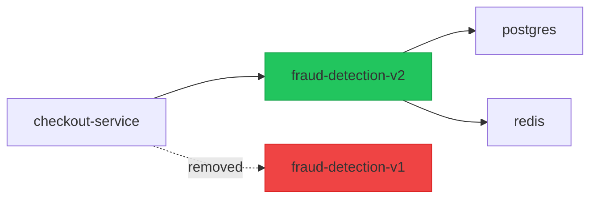

# GitLab App Integration Design

## Overview

Same capabilities as the GitHub App, implemented via GitLab Webhooks, GitLab API, and GitLab CI pipeline comments. The Graphon backend handles both GitHub and GitLab through a unified webhook dispatcher.

---

## Webhook Events Handled

| Event | Trigger |
|-------|---------|
| `merge_request_events` | MR opened, updated, re-opened |
| `push_events` | Direct push to main (detect unreviewed arch changes) |
| `pipeline_events` | Post-deploy snapshot creation |
| `tag_push_events` | Release tagging → automatic pre/post deploy snapshots |

---

## Configuration

```yaml
# values.yaml
backend:
  gitlab:
    enabled: true
    instanceUrl: "https://gitlab.com"     # or self-managed GitLab URL
    webhookSecret: ""                      # use existingSecret
    personalAccessToken: ""               # for posting comments; use existingSecret
    defaultCluster: "prod-us-east-1"
    postMRComment: true
    postPipelineStatus: true
    projectIds: []                         # empty = all projects; or list specific IDs
```

### GitLab Self-Managed

```yaml
backend:
  gitlab:
    instanceUrl: "https://gitlab.internal.example.com"
    tlsSkipVerify: false
    caCertSecret: "gitlab-ca-cert"
```

---

## MR Comment Format

```markdown
## 🔍 Graphon Architecture Impact

> Analyzed against cluster: **prod-us-east-1** | Baseline: `main` branch snapshot

### Summary
| Metric | Value |
|--------|-------|
| Services changed | 2 |
| Dependencies added | 3 |
| Dependencies removed | 1 |
| Risk level | 🟡 Medium |

### Impact Graph


[📊 Open in Graphon →](https://graphon.example.com)
```

---

## GitLab CI Integration

Add to `.gitlab-ci.yml` to trigger on-demand analysis:

```yaml
graphon-impact:
  stage: validate
  image: alpine/curl:latest
  script:
    - |
      curl -X POST https://graphon.example.com/api/v1/analyze \
        -H "Authorization: Bearer $GRAPHON_API_TOKEN" \
        -H "Content-Type: application/json" \
        -d '{
          "type": "gitlab-mr",
          "project_id": "'$CI_PROJECT_ID'",
          "mr_iid": "'$CI_MERGE_REQUEST_IID'",
          "base_ref": "'$CI_MERGE_REQUEST_TARGET_BRANCH_NAME'",
          "head_ref": "'$CI_MERGE_REQUEST_SOURCE_BRANCH_NAME'"
        }'
  rules:
    - if: $CI_PIPELINE_SOURCE == "merge_request_event"
```

---

## Webhook Endpoint

```
POST /api/v1/webhooks/gitlab
Headers:
  X-Gitlab-Token: <webhook-secret>
  X-Gitlab-Event: Merge Request Hook
```

The unified webhook handler dispatches to the appropriate provider parser:

```go
// internal/api/v1/handlers/webhooks.go
func (h *Handler) HandleWebhook(w http.ResponseWriter, r *http.Request) {
    provider := detectProvider(r) // github | gitlab
    switch provider {
    case "github":
        h.github.Process(r)
    case "gitlab":
        h.gitlab.Process(r)
    }
}
```
